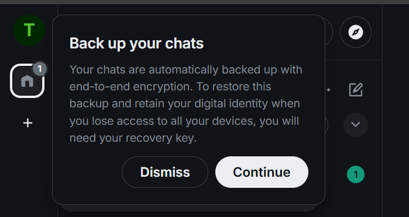
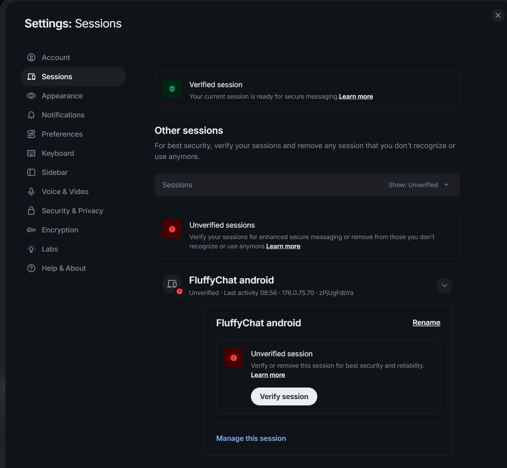
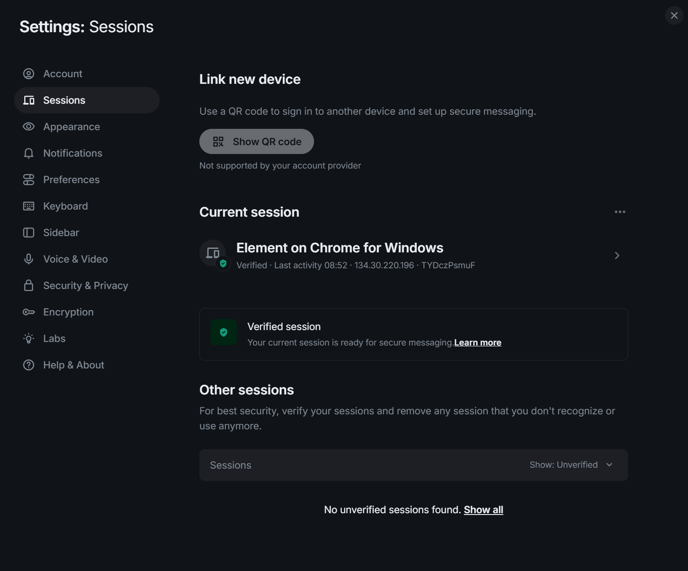
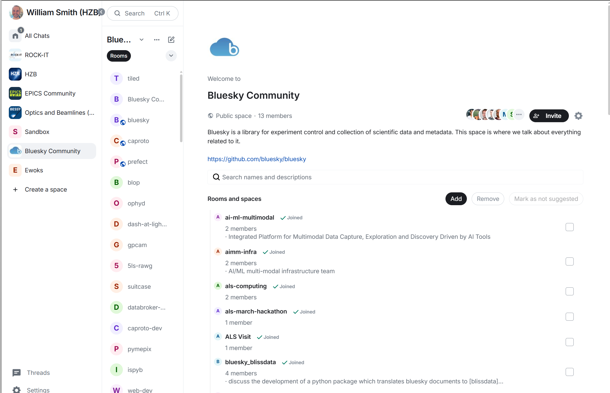
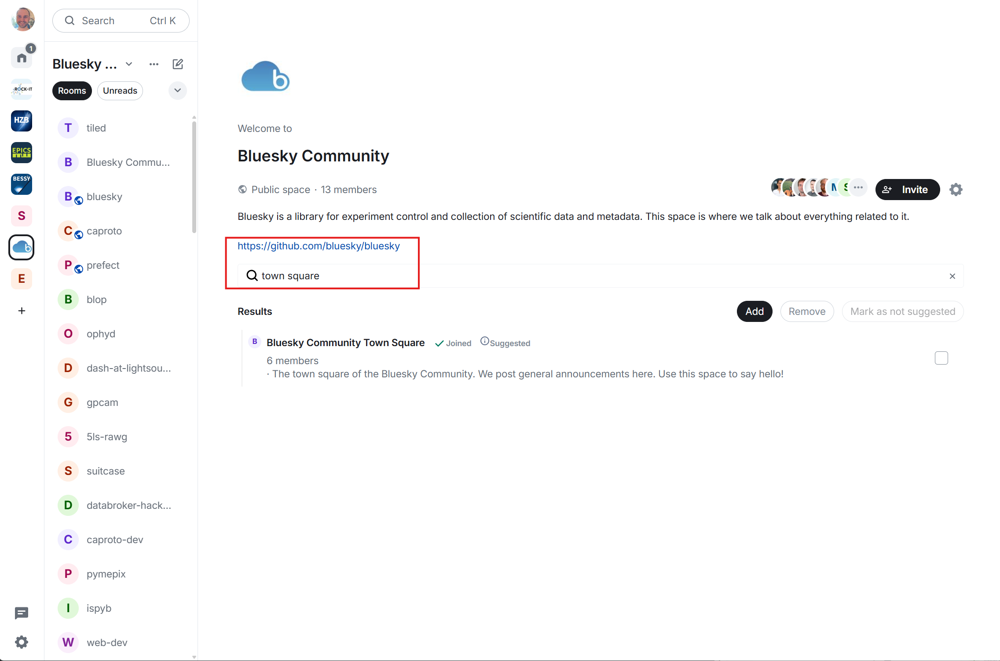

# Instructions for Bluesky Community to Join Matrix Chat

This is a how-to to join the Bluesky community chat. It does not give any explanation or details about what Matrix is. If you are interested, see the [Matrix introduction for instant messaging](https://matrix.org/docs/chat_basics/matrix-for-im/).

## 1. Make a Matrix account on a homeserver

- If you already have an account with a homeserver like `matrix.org` or `epics-controls.org`, then skip to step 2.
- If you need to make an account, the easiest option is to use `matrix.org` and authenticate against a Google or GitHub account. You can register using [Element](https://app.element.io/#/register).
- Once you have registered you can use any client to log in. Make sure to save any recovery keys when prompted.

- It is not mandatory, but it is helpful to additionally sign in on another device, either with the same client or a different one. One option is to do this on your phone using the [FluffyChat app, which is available on both Android and Apple devices](https://fluffy.chat/en/).
- Once you have logged in on both devices, go to settings in the `element.io` client on your web browser on your computer, go to Sessions, then find the session you have just started on your other device and verify it.

- You will be prompted to confirm that some emojis match. Once complete, you will see the other session is shown as verified.

- Congratulations, you have now created an account on a Matrix homeserver and logged in with two separate clients.

## 2. Join the Bluesky Community Space

Open this link: [https://matrix.to/#/#bluesky-community:helmholtz.cloud](https://matrix.to/#/#bluesky-community:helmholtz.cloud).

Please note, this space is not searchable in the public space registry. You can only get to it with this invite link.

It will take you to the space landing page. From there you can see rooms to join if they are interesting to you.

## 3. Say hello on the Town Square

Please join the Town Square room.

Say hello so we know you are there.
