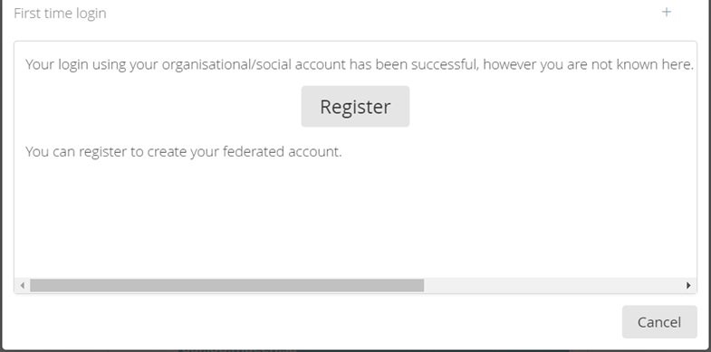
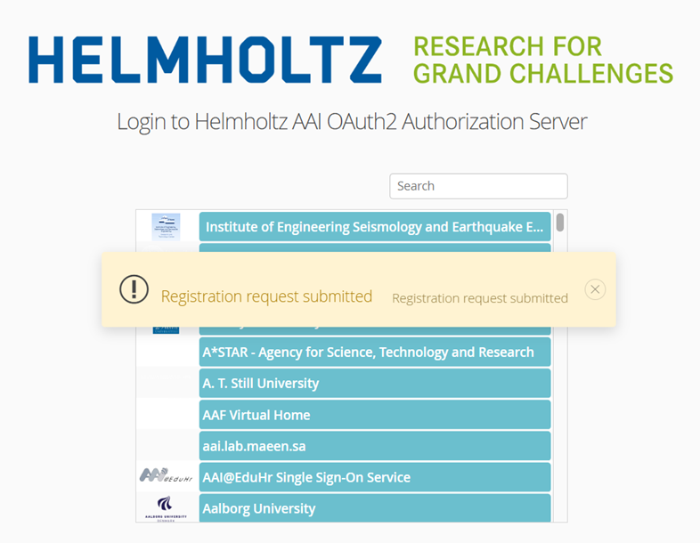
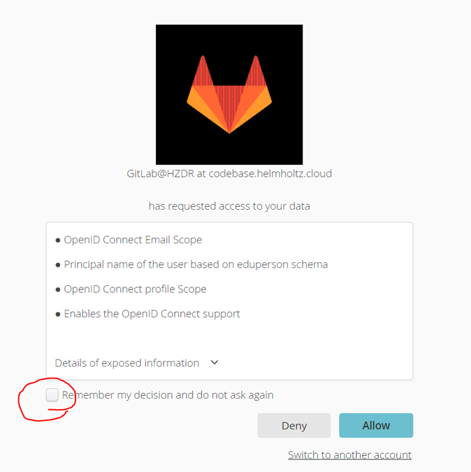
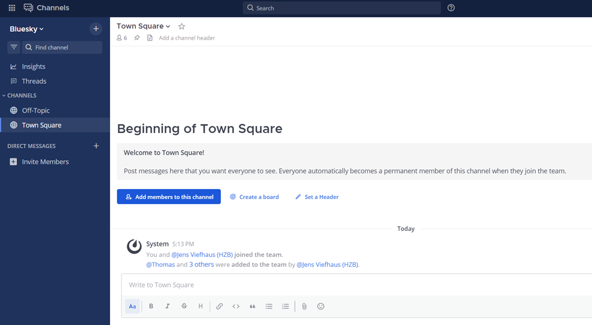
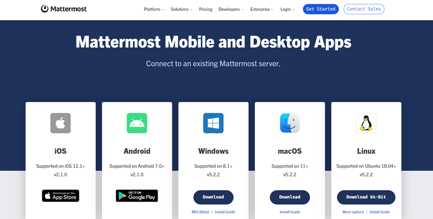

## How to register with Mattermost

You can use an existing Github, Google, ORCID or possibly an institutional account to authenticate. Follow the steps below. It should take less than 5 mins.

1. Use this [link](https://mattermost.hzdr.de/signup_user_complete/?id=xr4bwecii7n6j8sj63ktqnk13amd=linksbr=su). You'll be presented with the following page. When prompted press the button **"Gitlab"** under **"Create your account with one of the following:"**

2. Ignore the request for HZDR credentials. Look at the bottom of the page, press the button marked **Helmholtz AAI**

3. In the search box look for Github, Google, ORCID or your institute.

4. You will see this screen and be asked to register

5. You will then be asked for some more details. Remember to press "I agree" before "submit".

6. You will get a message saying **"Registration Submitted"**

7. After you submit this you'll be sent an email to the email address you entered in step 5. Open this email and press the confirmation link.

8. You can now attempt to log in again using the same Github, Google, ORCID etc that you used [before](https://mattermost.hzdr.de/login). When asked you should press "remember my descision" and then "Allow".

9. You should now be at a "Town Square" page

10. Look at the top left, there is a **"+"**. Press this to see the other channels available that you can join. 

## Connecting a Desktop Client or Mobile Client

If you like you can install a desktop or mobile client. from [this link](https://mattermost.com/apps/)

You will need the HZDR mattermost URL: **https://mattermost.hzdr.de/**

